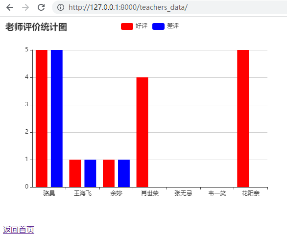

### 用户登录

接着来实现用户登录才能对教师打分的功能

1.首先在models.py里添加上用户

```python
class User(models.Model):
    """用户"""
    no = models.AutoField(primary_key=True, verbose_name='编号')
    username = models.CharField(max_length=20, unique=True, verbose_name='用户名')
    password = models.CharField(max_length=32, verbose_name='密码')
    tel = models.CharField(max_length=20, verbose_name='手机号')
    reg_date = models.DateTimeField(auto_now_add=True, verbose_name='注册时间')
    last_visit = models.DateTimeField(null=True, verbose_name='最后登录时间')

    class Meta:
        db_table = 'tb_user'
        verbose_name = '用户'
        verbose_name_plural = '用户'
```

2.在终端运行以下语句，反向在数据库中创建用户表tb_user

```python
python manage.py makemigrations polls
python manage.py migrate polls
```

3.用以下语句插入两条数据。密码在数据库中通常不会明码存储，所以这里密码字段经过了MD5加密

```python
insert into `tb_user`
    (`username`, `password`, `tel`, `reg_date`)
values
    ('hanayo', '31528198109743225ff9d0cf04d1fdd1', '13122334455', now()),
    ('rin', 'c6f8cf68e5f68b0aa4680e089ee4742c', '13890006789', now());
```

> **说明**：上面创建的两个用户hanayo和rin密码分别是`abc@1234`和`Abc123!!`
> 

4.在polls目录下增加一个utils.py文件。用hashlib中提供的MD5方法来处理加密

```python
import hashlib

def gen_md5_digest(content):
    return hashlib.md5(content.encode()).hexdigest()
```

5.编辑登录视图和登录页面

在views.py里增加如下方法

```python
from django.http import HttpRequest, HttpResponse

def login(request: HttpRequest) -> HttpResponse:
    hint = ''
    return render(request, 'login.html', {'hint': hint})
```

login.html模版页代码如下：

```python
<!DOCTYPE html>
<html lang="en">
<head>
    <meta charset="UTF-8">
    <title>用户登录</title>
    <style>
        #container {
            width: 520px;
            margin: 10px auto;
        }
        .input {
            margin: 20px 0;
            width: 460px;
            height: 40px;
        }
        .input>label {
            display: inline-block;
            width: 140px;
            text-align: right;
        }
        .input>img {
            width: 150px;
            vertical-align: middle;
        }
        input[name=captcha] {
            vertical-align: middle;
        }
        form+div {
            margin-top: 20px;
        }
        form+div>a {
            text-decoration: none;
            color: darkcyan;
            font-size: 1.2em;
        }
        .button {
            width: 500px;
            text-align: center;
            margin-top: 20px;
        }
        .hint {
            color: red;
            font-size: 12px;
        }
    </style>
</head>
<body>
    <div id="container">
        <h1>用户登录</h1>
        <hr>
        <p class="hint">{{ hint }}</p>
        <form action="/login/" method="post">
            
            <fieldset>
                <legend>用户信息</legend>
                <div class="input">
                    <label>用户名：</label>
                    <input type="text" name="username">
                </div>
                <div class="input">
                    <label>密码：</label>
                    <input type="password" name="password">
                </div>
                <div class="input">
                    <label>验证码：</label>
                    <input type="text" name="captcha">
                    
                </div>
            </fieldset>
            <div class="button">
                <input type="submit" value="登录">
                <input type="reset" value="重置">
            </div>
        </form>
        <div>
            <a href="/">返回首页</a>
            <a href="/register/">注册新用户</a>
        </div>
    </div>
</body>
</html>
```

> 上面的表单中，我们使用了模板指令为表单添加一个隐藏域（大家可以在浏览器中显示网页源代码就可以看到这个指令生成的type属性为hidden的input标签），它的作用是在表单中生成一个随机令牌（token）来防范跨站请求伪造（简称为CSRF），这也是Django在提交表单时的硬性要求。如果我们的表单中没有这样的令牌，那么提交表单时，Django框架会产生一个响应状态码为403的响应（禁止访问），除非我们设置了免除CSRF令牌。下图是一个关于CSRF简单生动的例子。
> 

这么做主要原因是防止不法网站利用浏览器存储的账号密码信息私自发起请求，而不是用户真实的请求。

### 用户跟踪

如今，记住用户的历史操作和用户习惯对一个网站应用来说几乎是必备的功能了。比如一个购物网站，知道用户习惯才能精准推送商品。在服务器端，一般的做法是创建一个session来保存用户信息。那么问题就变成了，每次用户通过http请求的时候，如何辨认用户的sessionID。

主要有以下几种方式

1.将sessionID包含在url中，例如：http://www.example.com/index.html?sessionid=123456

2.隐藏域（隐式表单域）。将sessionID保存在表单隐藏域中发给服务器，<input type="hidden" name="sessionid" value="123456">

3.本地存储。也就是cookie

本次我们就用第三种方式。默认的配置文件`settings.py`文件中已经激活了一个名为`SessionMiddleware`的中间件，我们可以直接通过请求对象的`session`属性来操作会话对象。

### 实现用户登录验证

1.我们在刚才的`polls/utils.py`文件中编写生成随机验证码的函数`gen_random_code`

```python
import random

ALL_CHARS = '0123456789abcdefghijklmnopqrstuvwxyzABCDEFGHIJKLMNOPQRSTUVWXYZ'

def gen_random_code(length=4):
    return ''.join(random.choices(ALL_CHARS, k=length))
```

2.编写生成验证码图片的类`Captcha`，注意这里生成验证码用到的字体需要准备好

```python
"""
图片验证码
"""
import os
import random
from io import BytesIO

from PIL import Image
from PIL import ImageFilter
from PIL.ImageDraw import Draw
from PIL.ImageFont import truetype

class Bezier:
    """贝塞尔曲线"""

    def __init__(self):
        self.tsequence = tuple([t / 20.0 for t in range(21)])
        self.beziers = {}

    def make_bezier(self, n):
        """绘制贝塞尔曲线"""
        try:
            return self.beziers[n]
        except KeyError:
            combinations = pascal_row(n - 1)
            result = []
            for t in self.tsequence:
                tpowers = (t ** i for i in range(n))
                upowers = ((1 - t) ** i for i in range(n - 1, -1, -1))
                coefs = [c * a * b for c, a, b in zip(combinations,
                                                      tpowers, upowers)]
                result.append(coefs)
            self.beziers[n] = result
            return result

class Captcha:
    """验证码"""

    def __init__(self, width, height, fonts=None, color=None):
        self._image = None
        self._fonts = fonts if fonts else \
            [os.path.join(os.path.dirname(__file__), 'fonts', font)
             for font in ['Arial.ttf', 'Georgia.ttf', 'Action.ttf']]
        self._color = color if color else random_color(0, 200, random.randint(220, 255))
        self._width, self._height = width, height

    @classmethod
    def instance(cls, width=200, height=75):
        """用于获取Captcha对象的类方法"""
        prop_name = f'_instance_{width}_{height}'
        if not hasattr(cls, prop_name):
            setattr(cls, prop_name, cls(width, height))
        return getattr(cls, prop_name)

    def _background(self):
        """绘制背景"""
        Draw(self._image).rectangle([(0, 0), self._image.size],
                                    fill=random_color(230, 255))

    def _smooth(self):
        """平滑图像"""
        return self._image.filter(ImageFilter.SMOOTH)

    def _curve(self, width=4, number=6, color=None):
        """绘制曲线"""
        dx, height = self._image.size
        dx /= number
        path = [(dx * i, random.randint(0, height))
                for i in range(1, number)]
        bcoefs = Bezier().make_bezier(number - 1)
        points = []
        for coefs in bcoefs:
            points.append(tuple(sum([coef * p for coef, p in zip(coefs, ps)])
                                for ps in zip(*path)))
        Draw(self._image).line(points, fill=color if color else self._color, width=width)

    def _noise(self, number=50, level=2, color=None):
        """绘制扰码"""
        width, height = self._image.size
        dx, dy = width / 10, height / 10
        width, height = width - dx, height - dy
        draw = Draw(self._image)
        for i in range(number):
            x = int(random.uniform(dx, width))
            y = int(random.uniform(dy, height))
            draw.line(((x, y), (x + level, y)),
                      fill=color if color else self._color, width=level)

    def _text(self, captcha_text, fonts, font_sizes=None, drawings=None, squeeze_factor=0.75, color=None):
        """绘制文本"""
        color = color if color else self._color
        fonts = tuple([truetype(name, size)
                       for name in fonts
                       for size in font_sizes or (65, 70, 75)])
        draw = Draw(self._image)
        char_images = []
        for c in captcha_text:
            font = random.choice(fonts)
            c_width, c_height = draw.textsize(c, font=font)
            char_image = Image.new('RGB', (c_width, c_height), (0, 0, 0))
            char_draw = Draw(char_image)
            char_draw.text((0, 0), c, font=font, fill=color)
            char_image = char_image.crop(char_image.getbbox())
            for drawing in drawings:
                d = getattr(self, drawing)
                char_image = d(char_image)
            char_images.append(char_image)
        width, height = self._image.size
        offset = int((width - sum(int(i.size[0] * squeeze_factor)
                                  for i in char_images[:-1]) -
                      char_images[-1].size[0]) / 2)
        for char_image in char_images:
            c_width, c_height = char_image.size
            mask = char_image.convert('L').point(lambda i: i * 1.97)
            self._image.paste(char_image,
                              (offset, int((height - c_height) / 2)),
                              mask)
            offset += int(c_width * squeeze_factor)

    @staticmethod
    def _warp(image, dx_factor=0.3, dy_factor=0.3):
        """图像扭曲"""
        width, height = image.size
        dx = width * dx_factor
        dy = height * dy_factor
        x1 = int(random.uniform(-dx, dx))
        y1 = int(random.uniform(-dy, dy))
        x2 = int(random.uniform(-dx, dx))
        y2 = int(random.uniform(-dy, dy))
        warp_image = Image.new(
            'RGB',
            (width + abs(x1) + abs(x2), height + abs(y1) + abs(y2)))
        warp_image.paste(image, (abs(x1), abs(y1)))
        width2, height2 = warp_image.size
        return warp_image.transform(
            (width, height),
            Image.QUAD,
            (x1, y1, -x1, height2 - y2, width2 + x2, height2 + y2, width2 - x2, -y1))

    @staticmethod
    def _offset(image, dx_factor=0.1, dy_factor=0.2):
        """图像偏移"""
        width, height = image.size
        dx = int(random.random() * width * dx_factor)
        dy = int(random.random() * height * dy_factor)
        offset_image = Image.new('RGB', (width + dx, height + dy))
        offset_image.paste(image, (dx, dy))
        return offset_image

    @staticmethod
    def _rotate(image, angle=25):
        """图像旋转"""
        return image.rotate(random.uniform(-angle, angle),
                            Image.BILINEAR, expand=1)

    def generate(self, captcha_text='', fmt='PNG'):
        """生成验证码(文字和图片)
        :param captcha_text: 验证码文字
        :param fmt: 生成的验证码图片格式
        :return: 验证码图片的二进制数据
        """
        self._image = Image.new('RGB', (self._width, self._height), (255, 255, 255))
        self._background()
        self._text(captcha_text, self._fonts,
                   drawings=['_warp', '_rotate', '_offset'])
        self._curve()
        self._noise()
        self._smooth()
        image_bytes = BytesIO()
        self._image.save(image_bytes, format=fmt)
        return image_bytes.getvalue()

def pascal_row(n=0):
    """生成毕达哥拉斯三角形（杨辉三角）"""
    result = [1]
    x, numerator = 1, n
    for denominator in range(1, n // 2 + 1):
        x *= numerator
        x /= denominator
        result.append(x)
        numerator -= 1
    if n & 1 == 0:
        result.extend(reversed(result[:-1]))
    else:
        result.extend(reversed(result))
    return result

def random_color(start=0, end=255, opacity=255):
    """获得随机颜色"""
    red = random.randint(start, end)
    green = random.randint(start, end)
    blue = random.randint(start, end)
    if opacity is None:
        return red, green, blue
    return red, green, blue, opacity
```

> **说明**：上面的代码中用到了三个字体文件Arial.ttf，Georgia.ttf，Action.ttf，字体文件位于`polls/fonts`目录下
> 

3.在views.py添加如下方法

```python
def get_captcha(request: HttpRequest) -> HttpResponse:
    """验证码"""
    captcha_text = gen_random_code()
    request.session['captcha'] = captcha_text
    image_data = Captcha.instance().generate(captcha_text)
    return HttpResponse(image_data, content_type='image/png')
```

4.将随机生成的验证码字符串保存到session中，稍后用户登录时，我们要将保存在session中的验证码字符串和用户输入的验证码字符串进行比对，如果用户输入了正确的验证码才能够执行后续的登录流程，在views.py中修改login方法：

```python
def login(request: HttpRequest) -> HttpResponse:
    hint = ''
    if request.method == 'POST':
        username = request.POST.get('username')
        password = request.POST.get('password')
        if username and password:
            password = gen_md5_digest(password)
            user = User.objects.filter(username=username, password=password).first()
            if user:
                request.session['userid'] = user.no
                request.session['username'] = user.username
                return redirect('/')
            else:
                hint = '用户名或密码错误'
        else:
            hint = '请输入有效的用户名和密码'
    return render(request, 'login.html', {'hint': hint})
```

> 注意，此时views.py顶上的import需要更新，目前大概是下面这样，当然不排除后面还要加
> 

```sql
from django.http import JsonResponse
from django.http import HttpRequest, HttpResponse
from django.shortcuts import render, redirect
from polls.models import Subject, Teacher, User
from polls.utils import gen_random_code, Captcha, gen_md5_digest
```

5.登录成功后会在session中保存用户的编号（`userid`）和用户名（`username`），页面会重定向到首页。接下来我们可以稍微对首页的代码进行调整，在页面的右上角显示出登录用户的用户名。在templates文件夹下新建名为header.html的HTML文件，首页中可以通过在`<body>`标签中添加``来包含这个页面，代码如下所示

```html
<div class="user">
    
    <span>{{ request.session.username }}</span>
    <a href="/logout">注销</a>
    
    <a href="/login">登录</a>&nbsp;&nbsp;
    
    <a href="/register">注册</a>
</div>
```

> 目前teachers.html还没有登录选项，可以试着如下方式加入
> 

```python
--前略
<body>
    <div id="container">
        
        <h1>{{ subject.name }}学科的老师信息</h1>
        <hr>
        
            <h2>暂无该学科老师信息</h2>
        
        
        <div class="teacher">
--后略
```

在teachers.html的style里加上user的样式，否则这里会看起来奇怪

```python
.user {
           float: right;
           margin-right: 10px;
       }
       .user>a {
           margin-right: 10px;
       }
```

> 在subjects页面如下加入
> 

```html
<div id="container">
       <!--这里加入，把这里原先的class=user的块替换掉-->
       
       <h1>扣丁学堂所有学科</h1>
```

6.在views.py中增加如下方法用于注销

```python
def logout(request):
    """注销"""
    request.session.flush()
    return redirect('/')
```

7.在urls.py中，加入登录页和验证码的映射

```python
urlpatterns = [
    path('admin/', admin.site.urls),
    path('', show_subjects),
    path('teachers/', show_teachers),
    path('praise/', views.praise_or_criticize),
    path('criticize/', views.praise_or_criticize),
    path('login/', views.login),  # 加入登录页
    path('logout/', views.logout),  # 加入注销页
    path('captcha/', views.get_captcha),  # 验证码
]
```

### Session结构（内容作为补充，代码无修改

我们可以通过项目使用的数据库中名为`django_session` 的表来找到所有的session，该表的结构如下所示：

| session_key | session_data | expire_date |
| --- | --- | --- |
| c9g2gt5cxo0k2evykgpejhic5ae7bfpl | MmI4YzViYjJhOGMyMDJkY2M5Yzg3... | 2019-05-25 23:16:13.898522 |

第1列就是浏览器cookie中保存的sessionid；第2列是经过BASE64编码后的session中的数据；第3列是session的过期时间。如果想清除过期数据，可以在终端中使用如下语句：

```python
python manage.py clearsessions
```

Django框架默认的session过期时间为两周（1209600秒），如果想修改这个时间，可以在项目的settings.py中添加如下所示的代码。

```python
# 配置会话的超时时间为1天（86400秒）
SESSION_COOKIE_AGE = 86400
```

有很多对安全性要求较高的应用都必须在关闭浏览器窗口时让会话过期，不再保留用户的任何信息，如果希望在关闭浏览器窗口时就让会话过期（cookie中的sessionid失效），可以加入如下所示的配置。

```python
# 设置为True在关闭浏览器窗口时session就过期
SESSION_EXPIRE_AT_BROWSER_CLOSE = True
```

如果不希望将session的数据保存在数据库中，可以将其放入缓存中，对应的配置如下所示，缓存的配置和使用我们在后面讲解。

```
# 配置将会话对象放到缓存中存储
SESSION_ENGINE = 'django.contrib.sessions.backends.cache'
# 配置使用哪一组缓存来保存会话
SESSION_CACHE_ALIAS = 'default'
```

如果要修改session数据默认的序列化方式，可以将默认的`JSONSerializer`修改为`PickleSerializer`。

```python
SESSION_SERIALIZER = 'django.contrib.sessions.serializers.PickleSerializer'
```

### 登录后才能投票

修改views.py中的投票函数，代码如下：

```python
def praise_or_criticize(request: HttpRequest) -> HttpResponse:
    if request.session.get('userid'):
        try:
            tno = int(request.GET.get('tno'))
            teacher = Teacher.objects.get(no=tno)
            if request.path.startswith('/praise/'):
                teacher.good_count += 1
                count = teacher.good_count
            else:
                teacher.bad_count += 1
                count = teacher.bad_count
            teacher.save()
            data = {'code': 20000, 'mesg': '投票成功', 'count': count}
        except (ValueError, Teacher.DoesNotExist):
            data = {'code': 20001, 'mesg': '投票失败'}
    else:
        data = {'code': 20002, 'mesg': '请先登录'}
    return JsonResponse(data)
```

在修改了视图函数后，`teachers.html`也需要进行调整，用户如果没有登录，就将用户引导至登录页，登录成功再返回到投票页，<script>标签内容修改成如下这样即可。

`<script>    $(() => {        $('.comment > a').on('click', (evt) => {            evt.preventDefault()            let a = $(evt.target)            $.ajax({                url: a.attr('href'),                type: 'get',                dataType: 'json',                success: (json) => {                    if (json.code == 20000) {                        let span = a.next()                        span.text(parseInt(span.text()) + 1)                    } else if (json.code == 20002) {                        alert(json.mesg)                        location.href = '/login/?backurl=' + location.href                    } else {                        alert(json.message)                    }                }            })        })    })</script>`

前端页面在收到`{'code': 20001, 'mesg': '请先登录'}`后，可以将用户引导到登录页面。

```html
<script>
        $(() => {
            $('.comment > a').on('click', (evt) => {
                evt.preventDefault()
                let a = $(evt.target)
                $.ajax({
                    url: a.attr('href'),
                    type: 'get',
                    dataType: 'json',
                    success: (json) => {
                        if (json.code == 20000) {
                            let span = a.next()
                            span.text(parseInt(span.text()) + 1)
                        } else if (json.code == 20002) {
                            alert(json.mesg)
                            location.href = '/login/?backurl=' + location.href
                        } else {
                            alert(json.message)
                        }
                    }
                })
            })
        })
    </script>
```

### 检测浏览器是否支持cookie

每个`HttpRequest`对象都会绑定一个session属性，它是一个类似字典的对象，除了保存用户数据之外还提供了检测浏览器是否支持cookie的方法，包括：

1. `set_test_cookie`方法 - 设置用于测试的cookie。
2. `test_cookie_worked`方法 - 检测测试cookie是否工作。
3. `delete_test_cookie`方法 - 删除用于测试的cookie。
4. `set_expiry`方法 - 设置会话的过期时间。
5. `get_expire_age`/`get_expire_date`方法 - 获取会话的过期时间。
6. `clear_expired`方法 - 清理过期的会话。

以下代码可以检测浏览器是否支持cookie，并给出提示：

```python
def login(request):
    if request.method == 'POST':
        if request.session.test_cookie_worked():
            request.session.delete_test_cookie()
            # Add your code to perform login process here
        else:
            return HttpResponse("Please enable cookies and try again.")
    request.session.set_test_cookie()
    return render_to_response('login.html')
```

> 注意：本例中实际并没加这个
在实际项目中，经常遇到需要导出数据或者生成报表的需求。我们分别介绍导出到excel文件，导出pdf，和生成自定义报表。

### 导出excel数据

本例中，用xlwt来导出到excel。还需要导入BytesIO和quote方法

```python
pip install xlwt
import xlwt
from io import BytesIO
from urllib.parse import quote
```

在views.py中增加如下方法：

```python

def export_teachers_excel(request):
    # 创建工作簿
    wb = xlwt.Workbook()
    # 添加工作表
    sheet = wb.add_sheet('老师信息表')
    # 查询所有老师的信息
    queryset = Teacher.objects.all()
    # 向Excel表单中写入表头
    colnames = ('姓名', '介绍', '好评数', '差评数', '学科')
    for index, name in enumerate(colnames):
        sheet.write(0, index, name)
    # 向单元格中写入老师的数据
    props = ('name', 'detail', 'good_count', 'bad_count', 'subject')
    for row, teacher in enumerate(queryset):
        for col, prop in enumerate(props):
            value = getattr(teacher, prop, '')
            if isinstance(value, Subject):
                value = value.name
            sheet.write(row + 1, col, value)
    # 保存Excel
    buffer = BytesIO()
    wb.save(buffer)
    # 将二进制数据写入响应的消息体中并设置MIME类型
    resp = HttpResponse(buffer.getvalue(), content_type='application/vnd.ms-excel')
    # 中文文件名需要处理成百分号编码
    filename = quote('老师.xls')
    # 通过响应头告知浏览器下载该文件以及对应的文件名
    resp['content-disposition'] = f'attachment; filename*=utf-8\'\'{filename}'
    return resp
```

在urls.py中增加映射

```python
urlpatterns = [
    
    path('excel/', views.export_teachers_excel),
    
]
```

> 没有制作导出的页面，所以是直接在浏览器输入[http://127.0.0.1:8000/excel](http://127.0.0.1:8000/admin)来进行下载。注意别忘了启动服务python [manage.py](http://manage.py/) runserver
> 

### 导出PDF报表

在Django项目中，如果需要导出PDF报表，可以借助三方库`reportlab`来生成PDF文件的内容，再将文件的二进制数据输出给浏览器并指定MIME类型为`application/pdf`，具体的代码如下所示。

```python
from reportlab.pdfgen import canvas

def export_pdf(request: HttpRequest) -> HttpResponse:
    buffer = BytesIO()
    pdf = canvas.Canvas(buffer)
    pdf.setFont("Helvetica", 80)
    pdf.setFillColorRGB(0.2, 0.5, 0.3)
    pdf.drawString(100, 550, 'hello, world!')
    pdf.showPage()
    pdf.save()
    resp = HttpResponse(buffer.getvalue(), content_type='application/pdf')
    resp['content-disposition'] = 'inline; filename="demo.pdf"'
    return resp
```

在urls.py中增加映射

```python
urlpatterns = [
    
    path('pdf/', views.export_pdf),
    
]
```

> 同样是浏览器输入[http://127.0.0.1:8000/pdf](http://127.0.0.1:8000/admin)来进行下载。注意，这个例子实际上是没有数据的，默认值是hello，world
> 

### 生成图表

> 吐槽一下，这一部分完全就是我根据其他网上搜索到的信息自己写的，原文基本没啥好参考的。
> 

如果需要生成柱状图之类的图表，我们可以使用百度的[ECharts](https://echarts.baidu.com/)

可以直接在html文件中用如下语句引用：

```html
<script src="https://cdn.bootcss.com/echarts/4.2.1-rc1/echarts.min.js"></script>
```

1.在views.py中增加如下方法：

```python
def get_teachers_data(request):
    queryset = Teacher.objects.all()
    names = [teacher.name for teacher in queryset]
    good_counts = [teacher.good_count for teacher in queryset]
    bad_counts = [teacher.bad_count for teacher in queryset]
    return render(request, "teachers_data.html", {
        "names": names, "good_counts": good_counts, "bad_counts": bad_counts
    })
```

2.修改urls.py，增加映射

```python
urlpatterns = [
    path('teachers_data/', views.get_teachers_data),
]
```

3.在templates中增加模板页：teachers_data.html

```html
<!DOCTYPE html>
<html lang="en">
<head>
    <meta charset="UTF-8">
    <title>老师评价统计</title>
</head>
<body>
    <div id="main" style="width: 600px; height: 400px"></div>
    <p>
        <a href="/">返回首页</a>
    </p>
    <script src="https://cdn.bootcss.com/echarts/4.2.1-rc1/echarts.min.js"></script>
    <script>
        window.names={{ names|safe }}
        window.good_counts={{ good_counts|safe }}
        window.bad_counts={{ bad_counts|safe }}
    </script>
    <script>
        var myChart = echarts.init(document.querySelector('#main'))
        var option = {
            color: ['#f00', '#00f'],
            title: {
                text: '老师评价统计图'
            },
            tooltip: {},
            legend: {
                data:['好评', '差评']
            },
            xAxis: {
                data: names
            },
            yAxis: {},
            series: [
                {
                    name: '好评',
                    type: 'bar',
                    data: good_counts
                },
                {
                    name: '差评',
                    type: 'bar',
                    data: bad_counts
                }
            ]
        }
        myChart.setOption(option)
    </script>
</body>
</html>
```

> 在浏览器中输入：[http://127.0.0.1:8000/teachers_data/](http://127.0.0.1:8000/teachers_data/) 即可查看效果
>


