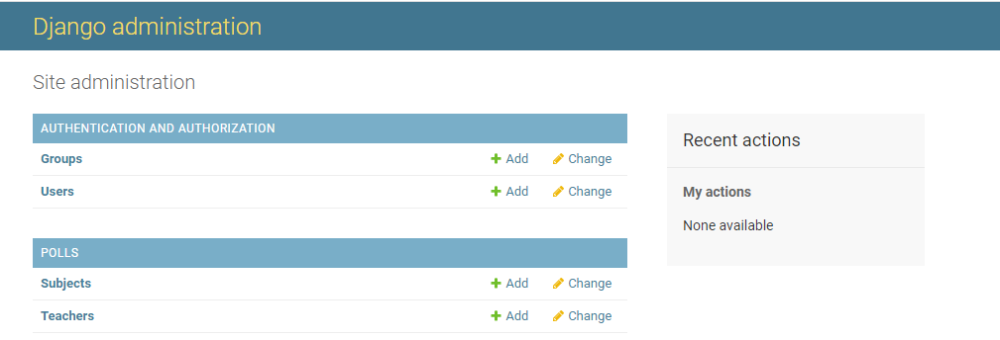
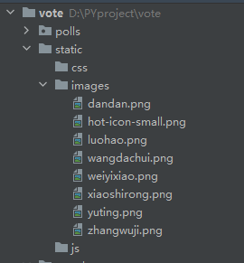
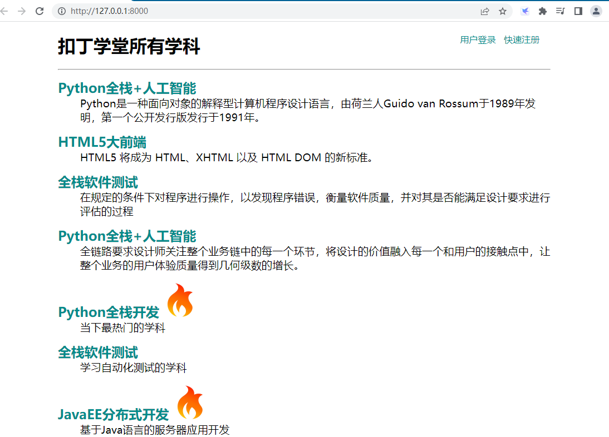
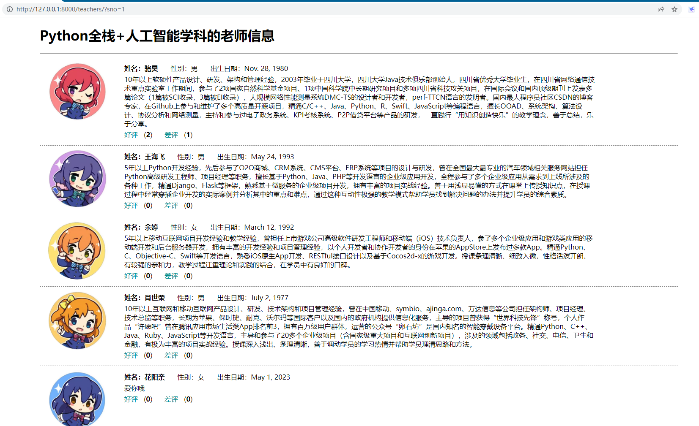

# kayotin-vote
本案例将结合Django和Mysql，实现一个投票项目。
### 项目介绍

本项目源于以下链接，主要参考了这个100天学习Python。

原文链接：[https://github.com/jackfrued/Python-100-Days/blob/master/Day41-55/42.深入模型.md](https://github.com/jackfrued/Python-100-Days/blob/master/Day41-55/42.%E6%B7%B1%E5%85%A5%E6%A8%A1%E5%9E%8B.md)

但是呢，原文并没有上传本项目的源码，而且有的地方也说的很不清楚，导致学习的时候走了很多弯路。所以这里把项目源码上传上来，希望后面学习的同学可以少走一点弯路。

### 项目功能

本案例将结合Django和Mysql，实现一个投票项目。

- 投票项目的首页会展示某在线教育平台所有的学科；
- 点击学科可以查看到该学科的老师及其信息；
- 用户登录后在查看老师的页面为老师投票，可以投赞成票和反对票；
- 未登录的用户可以通过登录页进行登录；
- 尚未注册的用户可以通过注册页输入个人信息进行注册。
- ### 创建项目

在cmd输入以下命令创建项目vote

```python
django-admin startproject vote
```

用pycharm打开项目，指定虚拟环境，然后在终端中输入以下命令新建一个应用polls

```python
python manage.py startapp polls
```

在主目录新建一个保存模板页的文件夹`tempaltes`，包含4个静态页面。分别是展示学科的页面`subjects.html`，显示学科老师的页面`teachers.html`，登录页面`login.html`，注册页面`register.html`

修改配置文件settings.py，指定模版文件路径，也就是Templates中的DIRS项
```python
TEMPLATES = [
    {
        'BACKEND': 'django.template.backends.django.DjangoTemplates',
        'DIRS': [os.path.join(BASE_DIR, 'templates'), ],
        'APP_DIRS': True,
        'OPTIONS': {
            'context_processors': [
                'django.template.context_processors.debug',
                'django.template.context_processors.request',
                'django.contrib.auth.context_processors.auth',
                'django.contrib.messages.context_processors.messages',
            ],
        },
    },
]
```

### 配置Mysql

1.创建数据库，添加用户，授予权限
```sql
create database vote default charset utf8;
create user 'hellokitty'@'%' identified by '123123';
grant all privileges on vote.* to 'hellokitty'@'%';
flush privileges;
```

2.创建表格

```sql
use vote;

-- 创建学科表
create table `tb_subject`
(
	`no` integer auto_increment comment '学科编号',
    `name` varchar(50) not null comment '学科名称',
    `intro` varchar(1000) not null default '' comment '学科介绍',
    `is_hot` boolean not null default 0 comment '是不是热门学科',
    primary key (`no`)
);
-- 创建老师表
create table `tb_teacher`
(
    `no` integer auto_increment comment '老师编号',
    `name` varchar(20) not null comment '老师姓名',
    `sex` boolean not null default 1 comment '老师性别',
    `birth` date not null comment '出生日期',
    `intro` varchar(1000) not null default '' comment '老师介绍',
    `photo` varchar(255) not null default '' comment '老师照片',
    `gcount` integer not null default 0 comment '好评数',
    `bcount` integer not null default 0 comment '差评数',
    `sno` integer not null comment '所属学科',
    primary key (`no`),
    foreign key (`sno`) references `tb_subject` (`no`)
);
```

插入数据：

```python
INSERT INTO `tb_subject` (`no`,`name`,`intro`) 
VALUES 
(1, 'Python全栈+人工智能', 'Python是一种面向对象的解释型计算机程序设计语言，由荷兰人Guido van Rossum于1989年发明，第一个公开发行版发行于1991年。'),
(2, 'JavaEE+分布式服务', 'Java是一门面向对象编程语言，不仅吸收了C++语言的各种优点，还摒弃了C++里难以理解的多继承、指针等概念，因此Java语言具有功能强大和简单易用两个特征。'),
(3, 'HTML5大前端', 'HTML5 将成为 HTML、XHTML 以及 HTML DOM 的新标准。'),
(4, '全栈软件测试', '在规定的条件下对程序进行操作，以发现程序错误，衡量软件质量，并对其是否能满足设计要求进行评估的过程'),
(5, '全链路UI/UE', '全链路要求设计师关注整个业务链中的每一个环节，将设计的价值融入每一个和用户的接触点中，让整个业务的用户体验质量得到几何级数的增长。');

INSERT INTO `tb_teacher` (`no`,`name`,`sex`,`birth`,`intro`,`gcount`,`bcount`,`photo`,`sno`) 
VALUES 
(1, '骆昊', 1, '1980-11-28', '10年以上软硬件产品设计、研发、架构和管理经验，2003年毕业于四川大学，四川大学Java技术俱乐部创始人，四川省优秀大学毕业生，在四川省网络通信技术重点实验室工作期间，参与了2项国家自然科学基金项目、1项中国科学院中长期研究项目和多项四川省科技攻关项目，在国际会议和国内顶级期刊上发表多篇论文（1篇被SCI收录，3篇被EI收录），大规模网络性能测量系统DMC-TS的设计者和开发者，perf-TTCN语言的发明者。国内最大程序员社区CSDN的博客专家，在Github上参与和维护了多个高质量开源项目，精通C/C++、Java、Python、R、Swift、JavaScript等编程语言，擅长OOAD、系统架构、算法设计、协议分析和网络测量，主持和参与过电子政务系统、KPI考核系统、P2P借贷平台等产品的研发，一直践行“用知识创造快乐”的教学理念，善于总结，乐于分享。', 0, 0, 'images/luohao.png', 1),
(2, '王海飞', 1, '1993-05-24', '5年以上Python开发经验，先后参与了O2O商城、CRM系统、CMS平台、ERP系统等项目的设计与研发，曾在全国最大最专业的汽车领域相关服务网站担任Python高级研发工程师、项目经理等职务，擅长基于Python、Java、PHP等开发语言的企业级应用开发，全程参与了多个企业级应用从需求到上线所涉及的各种工作，精通Django、Flask等框架，熟悉基于微服务的企业级项目开发，拥有丰富的项目实战经验。善于用浅显易懂的方式在课堂上传授知识点，在授课过程中经常穿插企业开发的实际案例并分析其中的重点和难点，通过这种互动性极强的教学模式帮助学员找到解决问题的办法并提升学员的综合素质。', 0, 0, 'images/wangdachui.png', 1),
(3, '余婷', 0, '1992-03-12', '5年以上移动互联网项目开发经验和教学经验，曾担任上市游戏公司高级软件研发工程师和移动端（iOS）技术负责人，参了多个企业级应用和游戏类应用的移动端开发和后台服务器开发，拥有丰富的开发经验和项目管理经验，以个人开发者和协作开发者的身份在苹果的AppStore上发布过多款App。精通Python、C、Objective-C、Swift等开发语言，熟悉iOS原生App开发、RESTful接口设计以及基于Cocos2d-x的游戏开发。授课条理清晰、细致入微，性格活泼开朗、有较强的亲和力，教学过程注重理论和实践的结合，在学员中有良好的口碑。', 0, 0, 'images/yuting.png', 1),
(4, '肖世荣', 1, '1977-07-02', '10年以上互联网和移动互联网产品设计、研发、技术架构和项目管理经验，曾在中国移动、symbio、ajinga.com、万达信息等公司担任架构师、项目经理、技术总监等职务，长期为苹果、保时捷、耐克、沃尔玛等国际客户以及国内的政府机构提供信息化服务，主导的项目曾获得“世界科技先锋”称号，个人作品“许愿吧”曾在腾讯应用市场生活类App排名前3，拥有百万级用户群体，运营的公众号“卵石坊”是国内知名的智能穿戴设备平台。精通Python、C++、Java、Ruby、JavaScript等开发语言，主导和参与了20多个企业级项目（含国家级重大项目和互联网创新项目），涉及的领域包括政务、社交、电信、卫生和金融，有极为丰富的项目实战经验。授课深入浅出、条理清晰，善于调动学员的学习热情并帮助学员理清思路和方法。', 0, 0, 'images/xiaoshirong.png', 1),
(5, '张无忌', 1, '1987-07-07', '出生起便在冰火岛过着原始生活，踏入中土后因中玄冥神掌命危而带病习医，忍受寒毒煎熬七年最后因福缘际会练成“九阳神功”更在之后又练成了“乾坤大挪移”等盖世武功，几乎无敌于天下。 生性随和，宅心仁厚，精通医术和药理。20岁时便凭着盖世神功当上明教教主，率领百万教众及武林群雄反抗蒙古政权元朝的高压统治，最后推翻了元朝。由于擅长乾坤大挪移神功，上课遇到问题就转移话题，属于拉不出屎怪地球没有引力的类型。', 0, 0, 'images/zhangwuji.png', 5),
(6, '韦一笑', 1, '1975-12-15', '外号“青翼蝠王”，为明教四大护教法王之一。  身披青条子白色长袍，轻功十分了得。由于在修炼至阴至寒的“寒冰绵掌”时出了差错，经脉中郁积了至寒阴毒，只要运上内力，寒毒就会发作，如果不吸人血解毒，全身血脉就会凝结成冰，后得张无忌相助，以其高明医术配以“九阳神功”，终将寒毒驱去，摆脱了吸吮人血这一命运。由于轻功绝顶，学生一问问题就跑了。', 0, 0, 'images/weiyixiao.png', 3);
```

3.安装依赖库

```sql
pip install mysqlclient
```

> 由于兼容性问题，这里使用mysqlclient，而不是pymysql
> 

4.修改settings.py：在INSTALLED_APPS添加上polls，在DATABASES里输入数据库配置信息

```python
INSTALLED_APPS = [
    'django.contrib.admin',
    'django.contrib.auth',
    'django.contrib.contenttypes',
    'django.contrib.sessions',
    'django.contrib.messages',
    'django.contrib.staticfiles',
    'polls',
]

DATABASES = {
    'default': {
        # 数据库引擎配置
        'ENGINE': 'django.db.backends.mysql',
        # 数据库的名字
        'NAME': 'vote',
        # 数据库服务器的IP地址（本机可以写localhost或127.0.0.1）
        'HOST': '192.168.32.11',
        # 启动MySQL服务的端口号
        'PORT': 3306,
        # 数据库用户名和口令
        'USER': 'hellokitty',
        'PASSWORD': '123123',
        # 数据库使用的字符集
        'CHARSET': 'utf8',
        # 数据库时间日期的时区设定
        'TIME_ZONE': 'Asia/Chongqing',
    }
}
```

在配置ENGINE属性时，常用的可选值包括：

- `'django.db.backends.sqlite3'`：SQLite嵌入式数据库。
- `'django.db.backends.postgresql'`：BSD许可证下发行的开源关系型数据库产品。
- `'django.db.backends.mysql'`：甲骨文公司经济高效的数据库产品。
- `'django.db.backends.oracle'`：甲骨文公司关系型数据库旗舰产品。

5.Python作为面向对象的编程语言，使用对象来保存数据；而关系型数据库用关系模型，用二维表来保存数据，这是不兼容的。可以利用Django中的ORM来把上一步创建的表，变成Django中的模型类。
在终端运行如下语句：

```python
python manage.py inspectdb > polls/models.py
```

> 自动生成的该文件会导致shell环境无法启动，可能是编码问题，所以此处非常建议手动新建models.py文件
> 

对生成的models.py稍作调整：

```python
#coding:UTF-8
from django.db import models

class Subject(models.Model):
    no = models.AutoField(primary_key=True, verbose_name='编号')
    name = models.CharField(max_length=50, verbose_name='名称')
    intro = models.CharField(max_length=1000, verbose_name='介绍')
    is_hot = models.BooleanField(verbose_name='是否热门')
		
    def __str__(self):
        return self.name

    class Meta:
        managed = False
        db_table = 'tb_subject'

class Teacher(models.Model):
    no = models.AutoField(primary_key=True, verbose_name='编号')
    name = models.CharField(max_length=20, verbose_name='姓名')
    sex = models.BooleanField(default=True, verbose_name='性别')
    birth = models.DateField(verbose_name='出生日期')
    intro = models.CharField(max_length=1000, verbose_name='个人介绍')
    photo = models.ImageField(max_length=255, verbose_name='照片')
    good_count = models.IntegerField(default=0, db_column='gcount', verbose_name='好评数')
    bad_count = models.IntegerField(default=0, db_column='bcount', verbose_name='差评数')
    subject = models.ForeignKey(Subject, models.DO_NOTHING, db_column='sno',verbose_name='所属学科')
		
    def __str__(self):
        return self.name

    class Meta:
        managed = False
        db_table = 'tb_teacher'
```

### 使用ORM完成模型的CRUD操作
在pycharm的终端中，输入以下指令启动shell环境

```python
python manage.py shell
```

> 上一步已经讲过了，如果是用代码生成的models文件，可能会导致这里的shell无法启动
> 

新增：

注意以下指令都是在shell环境运行

```python
from polls.models import Subject

subject1 = Subject(name='Python全栈开发', intro='当下最热门的学科', is_hot=True)
subject1.save()
subject2 = Subject(name='全栈软件测试', intro='学习自动化测试的学科', is_hot=False)
subject2.save()
subject3 = Subject(name='JavaEE分布式开发', intro='基于Java语言的服务器应用开发', is_hot=True)
subject3.save()
```

删除：

```python
subject = Subject.objects.get(no=2)
subject.delete()
```

更新：

```python
subject = Subject.objects.get(no=5)
subject.name = 'Python全栈+人工智能'
subject.save()
```

查询：

```python
# 查询名称为“Python全栈+人工智能”的学科
Subject.objects.filter(name='Python全栈+人工智能')

# 查询名称包含“全栈”的学科（模糊查询）
Subject.objects.filter(name__contains='全栈')
Subject.objects.filter(name__startswith='全栈')
Subject.objects.filter(name__endswith='全栈')

# 查询所有热门学科
Subject.objects.filter(is_hot=True)

# 查询编号大于3小于10的学科
Subject.objects.filter(no__gt=3).filter(no__lt=10)
Subject.objects.filter(no__gt=3, no__lt=10)

# 查询编号在3到7之间的学科
Subject.objects.filter(no__ge=3, no__le=7)
Subject.objects.filter(no__range=(3, 7))
```

查询（单个）

```python
# 查询主键为1的学科
Subject.objects.get(pk=1)
Subject.objects.get(no=1)
Subject.objects.filter(no=1).first()
Subject.objects.filter(no=1).last()
```

排序

```python
# 查询所有学科按编号升序排列
Subject.objects.order_by('no')
# 查询所有部门按部门编号降序排列
Subject.objects.order_by('-no')
```

切片（分页查询）

```python
# 按编号从小到大查询前3个学科
Subject.objects.order_by('no')[:3]
```

计数

```python
# 查询一共有多少个学科
Subject.objects.count()
```

高级查询

```python
# 查询编号为1的学科的老师
Teacher.objects.filter(subject__no=1)  --不成功
Subject.objects.get(pk=1).teacher_set.all() 

# 查询学科名称有“全栈”二字的学科的老师
Teacher.objects.filter(Subject__name__contains='全栈') --不成功
```

### 使用Django后台管理模型

1.在pycharm终端输入以下语句在admin应用中创建二维表
```python
python manage.py migrate
```

2.创建用户

```python
python manage.py createsuperuser

```

```sql
以下是运行结果：
(venv) PS D:\PYproject\vote> python manage.py createsuperuser
Username (leave blank to use 'kayotin'): admin
Email address: admin@kayotin.cn
Password: 
Password (again):
Superuser created successfully.
```

3.启动项目，在[http://127.0.0.1:8000/admin](http://127.0.0.1:8000/admin)尝试登录

```sql
python manage.py runserver
```

登录成功后发现还是不能看到数据，需要注册

4.注册模型类（需要修改admin.py运行

```python
from django.contrib import admin

from polls.models import Subject, Teacher

admin.site.register(Subject)
admin.site.register(Teacher)
```

5.刷新后，在web界面进行CRUD操作



6.注册模型管理类

在后台查看部门信息的时候，显示的部门信息并不直观，为此我们再修改`admin.py`文件，通过注册模型管理类，可以在后台管理系统中更好的管理模型。

```python
from django.contrib import admin

from polls.models import Subject, Teacher

class SubjectModelAdmin(admin.ModelAdmin):
    list_display = ('no', 'name', 'intro', 'is_hot')
    search_fields = ('name', )
    ordering = ('no', )

class TeacherModelAdmin(admin.ModelAdmin):
    list_display = ('no', 'name', 'sex', 'birth', 'good_count', 'bad_count', 'subject')
    search_fields = ('name', )
    ordering = ('no', )

admin.site.register(Subject, SubjectModelAdmin)
admin.site.register(Teacher, TeacherModelAdmin)
```

> 为了更好的查看模型，我们为`Subject`类添加`__str__`魔法方法，并在该方法中返回学科名字。这样在查看老师的页面上显示老师所属学科时，就不再是`Subject object(1)`这样晦涩的信息，而是学科的名称。
### 教师页面和学科页面

1.修改polls/views.py，实现对教师和学科页面的渲染

```python
from django.shortcuts import render, redirect

from polls.models import Subject, Teacher

def show_subjects(request):
    subjects = Subject.objects.all().order_by('no')
    return render(request, 'subjects.html', {'subjects': subjects})

def show_teachers(request):
    try:
        sno = int(request.GET.get('sno'))
        teachers = []
        if sno:
            subject = Subject.objects.only('name').get(no=sno)
            teachers = Teacher.objects.filter(subject=subject).order_by('no')
        return render(request, 'teachers.html', {
            'subject': subject,
            'teachers': teachers
        })
    except (ValueError, Subject.DoesNotExist):
        return redirect('/')
```

2.修改templates/subjects.html

```python
<!DOCTYPE html>
<html lang="en">
<head>
   <meta charset="UTF-8">
   <title>学科信息</title>
   <style>
       #container {
           width: 80%;
           margin: 10px auto;
       }
       .user {
           float: right;
           margin-right: 10px;
       }
       .user>a {
           margin-right: 10px;
       }
       #main>dl>dt {
           font-size: 1.5em;
           font-weight: bold;
       }
       #main>dl>dd {
           font-size: 1.2em;
       }
       a {
           text-decoration: none;
           color: darkcyan;
       }
   </style>
</head>
<body>
   <div id="container">
       <div class="user">
           <a href="login.html">用户登录</a>
           <a href="register.html">快速注册</a>
       </div>
       <h1>扣丁学堂所有学科</h1>
       <hr>
       <div id="main">
           
           <dl>
               <dt>
                   <a href="/teachers/?sno={{ subject.no }}">{{ subject.name }}</a>
                   
                   
                   
               </dt>
               <dd>{{ subject.intro }}</dd>
           </dl>
           
       </div>
   </div>
</body>
</html>
```

修改templates/teachers.html

```python
<!DOCTYPE html>
<html lang="en">
<head>
    <meta charset="UTF-8">
    <title>老师信息</title>
    <style>
        #container {
            width: 80%;
            margin: 10px auto;
        }
        .teacher {
            width: 100%;
            margin: 0 auto;
            padding: 10px 0;
            border-bottom: 1px dashed gray;
            overflow: auto;
        }
        .teacher>div {
            float: left;
        }
        .photo {
            height: 140px;
            border-radius: 75px;
            overflow: hidden;
            margin-left: 20px;
        }
        .info {
            width: 75%;
            margin-left: 30px;
        }
        .info div {
            clear: both;
            margin: 5px 10px;
        }
        .info span {
            margin-right: 25px;
        }
        .info a {
            text-decoration: none;
            color: darkcyan;
        }
    </style>
</head>
<body>
    <div id="container">
        <h1>{{ subject.name }}学科的老师信息</h1>
        <hr>
        
            <h2>暂无该学科老师信息</h2>
        
        
        <div class="teacher">
            <div class="photo">
                
            </div>
            <div class="info">
                <div>
                    <span><strong>姓名：{{ teacher.name }}</strong></span>
                    <span>性别：{{ teacher.sex | yesno:'男,女' }}</span>
                    <span>出生日期：{{ teacher.birth | date:'Y年n月j日'}}</span>
                </div>
                <div class="intro">{{ teacher.intro }}</div>
                <div class="comment">
                    <a href="">好评</a>&nbsp;(<strong>{{ teacher.good_count }}</strong>)
                    &nbsp;&nbsp;&nbsp;&nbsp;
                    <a href="">差评</a>&nbsp;<strong>{{ teacher.bad_count }}</strong>)
                </div>
            </div>
        </div>
        
        <a href="/">返回首页</a>
    </div>
</body>
</html>
```

3.修改vote/urls.py，映射URL

```python
from django.contrib import admin
from django.urls import path

from polls.views import show_subjects, show_teachers

urlpatterns = [
    path('admin/', admin.site.urls),
    path('', show_subjects),
    path('teachers/', show_teachers),
]
```

> 注意，要从首页点击学科进入教师页面，否则教师是无法显示的

### 加载静态资源

如果要在项目中加载静态资源，也就是显示老师们的照片，我们需要指定静态资源的位置。在vote项目中，我们在主目录新建一个叫static的文件夹，下面有三个文件夹css，images，js。

所需的静态图片是以下这些，可以自己想想办法~，当然我这里是找的μ's的头像：



并且修改settings.py

```python
STATICFILES_DIRS = [os.path.join(BASE_DIR, 'static'), ]
STATIC_URL = '/static/'
```

### 用Ajax实现投票功能

Ajax简单来说就是不重新加载页面的情况下对当前网页进行局部刷新。

修改urls.py，为好评差评功能映射对应的url

```python
from django.contrib import admin
from django.urls import path

from vote import views

urlpatterns = [
    path('', views.show_subjects),
    path('teachers/', views.show_teachers),
    path('praise/', views.praise_or_criticize),
    path('criticize/', views.praise_or_criticize),
    path('admin/', admin.site.urls),
]
```

在views.py增加视图函数`praise_or_criticize`来支持“好评”和“差评”功能，该视图函数通过Django封装的JsonResponse类将字典序列化成JSON字符串作为返回给浏览器的响应内容。

```python
from django.http import JsonResponse

def praise_or_criticize(request):
    """好评"""
    try:
        tno = int(request.GET.get('tno'))
        teacher = Teacher.objects.get(no=tno)
        if request.path.startswith('/praise'):
            teacher.good_count += 1
            count = teacher.good_count
        else:
            teacher.bad_count += 1
            count = teacher.bad_count
        teacher.save()
        data = {'code': 20000, 'mesg': '操作成功', 'count': count}
    except (ValueError, Teacher.DoseNotExist):
        data = {'code': 20001, 'mesg': '操作失败'}
    return JsonResponse(data)
```

在teachers.html中，添加JQuery和Ajax来操作DOM

```python
<!DOCTYPE html>
<html lang="en">
<head>
    <meta charset="UTF-8">
    <title>老师信息</title>
    <style>
        #container {
            width: 80%;
            margin: 10px auto;
        }
        .teacher {
            width: 100%;
            margin: 0 auto;
            padding: 10px 0;
            border-bottom: 1px dashed gray;
            overflow: auto;
        }
        .teacher>div {
            float: left;
        }
        .photo {
            height: 140px;
            border-radius: 75px;
            overflow: hidden;
            margin-left: 20px;
        }
        .info {
            width: 75%;
            margin-left: 30px;
        }
        .info div {
            clear: both;
            margin: 5px 10px;
        }
        .info span {
            margin-right: 25px;
        }
        .info a {
            text-decoration: none;
            color: darkcyan;
        }
    </style>
</head>
<body>
    <div id="container">
        <h1>{{ subject.name }}学科的老师信息</h1>
        <hr>
        
            <h2>暂无该学科老师信息</h2>
        
        
        <div class="teacher">
            <div class="photo">
                
            </div>
            <div class="info">
                <div>
                    <span><strong>姓名：{{ teacher.name }}</strong></span>
                    <span>性别：{{ teacher.sex | yesno:'男,女' }}</span>
                    <span>出生日期：{{ teacher.birth }}</span>
                </div>
                <div class="intro">{{ teacher.intro }}</div>
                <div class="comment">
                    <a href="/praise/?tno={{ teacher.no }}">好评</a>&nbsp;&nbsp;
                    (<strong>{{ teacher.good_count }}</strong>)
                    &nbsp;&nbsp;&nbsp;&nbsp;
                    <a href="/criticize/?tno={{ teacher.no }}">差评</a>&nbsp;&nbsp;
                    (<strong>{{ teacher.bad_count }}</strong>)
                </div>
            </div>
        </div>
        
        <a href="/">返回首页</a>
    </div>
    <script src="https://cdn.bootcss.com/jquery/3.4.1/jquery.min.js"></script>
    <script>
        $(() => {
            $('.comment>a').on('click', (evt) => {
                evt.preventDefault()
                let url = $(evt.target).attr('href')
                $.getJSON(url, (json) => {
                    if (json.code == 20000) {
                        $(evt.target).next().text(json.count)
                    } else {
                        alert(json.mesg)
                    }
                })
            })
        })
    </script>
</body>
</html>
```

### 效果展示

学科页面：

教师界面：

### 用户登录(施工中)
