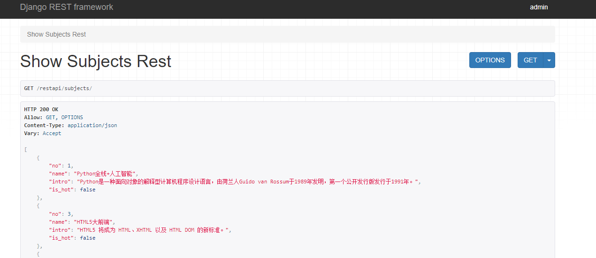
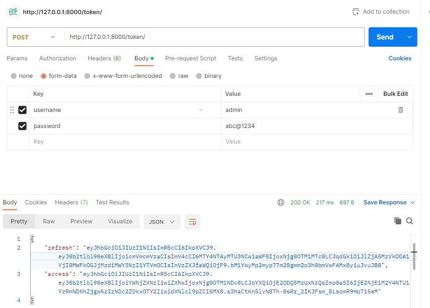

### RestAPI简介

关于什么是RestAPI，很难用三言两语解释清除。我的理解使，它是一种时下流行的，最常用的对网络资源(URI)进行CRUD的一种方式。

对于资源的具体操作类型，由HTTP动词表示。常用的HTTP动词有下面五个（括号里是对应的SQL命令）：

1. GET（SELECT）：   从服务器获取资源(一项或多项)
2. POST（CREATE）：  在服务器新建一个资源
3. PUT（UPDATE）：   在服务器更新资源（客户端提供改变后的完整资源）
4. .PATCH（UPDATE）： 在服务器更新资源（客户端提供改变的属性）
5. DELETE（DELETE）：从服务器删除资源。

### 使用DRF-`djangorestframework`

在Django项目中，如果要实现Rest风格的API，我们使用著名的三方库`djangorestframework` ，我们通常将其简称为DRF。

由于我们安装的是2.2.13的Django，所以这里安装3.10.0的DRF，否则可能会不兼容：

```python
pip install djangorestframework==3.10.0
```

在settings.py中配置：

```python
INSTALLED_APPS = [

    'rest_framework',
    
]

# 下面的配置根据项目需要进行设置
REST_FRAMEWORK = {
    # 配置默认页面大小
    # 'PAGE_SIZE': 10,
    # 配置默认的分页类
    # 'DEFAULT_PAGINATION_CLASS': '...',
    # 配置异常处理器
    # 'EXCEPTION_HANDLER': '...',
    # 配置默认解析器
    # 'DEFAULT_PARSER_CLASSES': (
    #     'rest_framework.parsers.JSONParser',
    #     'rest_framework.parsers.FormParser',
    #     'rest_framework.parsers.MultiPartParser',
    # ),
    # 配置默认限流类
    # 'DEFAULT_THROTTLE_CLASSES': (
    #     '...'
    # ),
    # 配置默认授权类
    # 'DEFAULT_PERMISSION_CLASSES': (
    #     '...',
    # ),
    # 配置默认认证类
    # 'DEFAULT_AUTHENTICATION_CLASSES': (
    #     '...',
    # ),
}
```

### 转换为字典

在前后端分离中我们介绍过，要返回Json数据，我们需要先把对象转换为字典格式的列表。DRF中封装了`Serializer`类和`ModelSerializer`类用于实现序列化操作

我们在views.py中加入如下代码

```python
from rest_framework import serializers 

class SubjectSerializer(serializers.ModelSerializer):

    class Meta:
        model = Subject
        fields = '__all__'
```

在views.py中加入如下代码

```python
from rest_framework.decorators import api_view
from rest_framework.response import Response

@api_view(('GET', ))
def show_subjects_rest(request: HttpRequest) -> HttpResponse:
    subjects = Subject.objects.all().order_by('no')
    # 创建序列化器对象并指定要序列化的模型
    serializer = SubjectSerializer(subjects, many=True)
    # 通过序列化器的data属性获得模型对应的字典并通过创建Response对象返回JSON格式的数据
    return Response(serializer.data)

def subjects_restapi(request):
    return redirect('/static/html/subjects_rest.html')
```

在urls.py中加入映射

```python
		path('restapi/subjects/', views.show_subjects_rest),
    path('subjects/', views.subjects_restapi)
```

> 前者用来返回Json数据，后者用来指向静态网页subjects_rest.html
> 

最后我们在/static/html/新建一个subjects_rest.html，内容和之前的vue渲染的完全一样，只是如下修改：

```html
<script>
        let app = new Vue({
            el: '#main',
            data: {
                subjects: []
            },
            created() {
<!--               只需修改这里,指向/restapi/subjects/-->
                fetch('/restapi/subjects/')
                    .then(resp => resp.json())
                    .then(json => {
                        this.subjects = json
                    })
            }
        })
    </script>
```

DRF的页面看上去很高级，可以看到具体的Json数据，我们访问http://127.0.0.1:8000/restapi/subjects/可以看到，界面如下：

> 最后我们访问，127.0.0.1:8000/subjects/就可以看到新的学科展示界面了。
> 

### 教师展示界面REST

首先为了返回Json数据，将教师数据序列化转换成字典，在Views.py中增加如下方法

```python
class TeacherSerializer(serializers.ModelSerializer):

    class Meta:
        model = Teacher
        exclude = ('subject', )
```

在views.py中增加如下视图函数：

```python
@api_view(('GET', ))
def show_teachers_rest(request: HttpRequest) -> HttpResponse:
    try:
        sno = int(request.GET.get('sno'))
        subject = Subject.objects.only('name').get(no=sno)
        teachers = Teacher.objects.filter(subject=subject).defer('subject').order_by('no')
        subject_seri = SubjectSerializer(subject)
        teacher_seri = TeacherSerializer(teachers, many=True)
        return Response({'subject': subject_seri.data, 'teachers': teacher_seri.data})
    except (TypeError, ValueError, Subject.DoesNotExist):
        return Response(status=404)
```

配置urls.py映射

```python
path('api/teachers_rest/', views.show_teachers_rest),
```

> 访问api/teachers_rest/，返回Json数据
> 

在static/html/下新增teachers_rest.html

```python
<!DOCTYPE html>
<html lang="en">
<head>
    <meta charset="UTF-8">
    <title>老师信息</title>
    <style>
			...样式省略，和之前的teachers.html是一样的，可以复制过来...
    </style>
</head>
<body>
    <div id="container">
        <h1>{{ subject.name }}学科的老师信息</h1>
        <hr>
        <h2 v-if="loaded && teachers.length == 0">暂无该学科老师信息</h2>
        <div class="teacher" v-for="teacher in teachers">
            <div class="photo">
                
            </div>
            <div class="info">
                <div>
                    <span><strong>姓名：{{ teacher.name }}</strong></span>
                    <span>性别：{{ teacher.sex | maleOrFemale }}</span>
                    <span>出生日期：{{ teacher.birth }}</span>
                </div>
                <div class="intro">{{ teacher.intro }}</div>
                <div class="comment">
                    <a href="" @click.prevent="vote(teacher, true)">好评</a>&nbsp;&nbsp;
                    (<strong>{{ teacher.good_count }}</strong>)
                    &nbsp;&nbsp;&nbsp;&nbsp;
                    <a href="" @click.prevent="vote(teacher, false)">差评</a>&nbsp;&nbsp;
                    (<strong>{{ teacher.bad_count }}</strong>)
                </div>
            </div>
        </div>
        <a href="/static/html/subjects_rest.html">返回首页</a>
    </div>
    <script src="https://cdn.bootcdn.net/ajax/libs/vue/2.6.11/vue.min.js"></script>
    <script>
        let app = new Vue({
            el: '#container',
            data: {
                subject: {},
                teachers: [],
                loaded: false
            },
            created() {
                fetch('/api/teachers_rest/' + location.search)
                    .then(resp => resp.json())
                    .then(json => {
                        this.subject = json.subject
                        this.teachers = json.teachers
                    })
            },
            filters: {
                maleOrFemale(sex) {
                    return sex? '男': '女'
                }
            },
            methods: {
               vote(teacher, flag) {
                    let url = flag? '/praise/' : '/criticize/'
                    url += '?tno=' + teacher.no
                    fetch(url).then(resp => resp.json()).then(json => {
                        if (json.code === 10000) {
                            if (flag) {
                                teacher.good_count = json.count
                            } else {
                                teacher.bad_count = json.count
                            }
                        }
                    })
                }
            }
        })
    </script>
</body>
</html>
```

> 注意，该教师页面也需要通过subjects页面点击访问。需要通过subjects指定sno访问
> 
> 


需要修改subjects_rest.html的38行：
```python
<a :href="'/teachers/?sno=' + [subject.no](http://subject.no/)">
```
为以下内容

```python
<a :href="'/static/html/teachers_rest/?sno=' + [subject.no](http://subject.no/)">
```

修改后，我们可以访问127.0.0.1:8000/subjects/，然后点击学科来访问新的教师展示页面。

### 前后端分离下的登录

我们之前是使用session来保存用户登录信息，接下来我们使用token

1. 用户登录时，如果登录成功就按照某种方式为用户生成一个令牌（token），该令牌中通常包含了用户标识、过期时间等信息而且需要加密并生成指纹（避免伪造或篡改令牌），服务器将令牌返回给前端；
2. 前端获取到服务器返回的token，保存在浏览器本地存储中（可以保存在`localStorage`或`sessionStorage`中，对于使用Vue.js的前端项目来说，还可以通过Vuex进行状态管理）；
3. 对于使用了前端路由的项目来说，前端每次路由跳转，可以先判断`localStroage`中有无token，如果没有则跳转到登录页；
4. 每次请求后端数据接口，在HTTP请求头里携带token；后端接口判断请求头有无token，如果没有token以及token是无效的或过期的，服务器统一返回401；
5. 如果前端收到HTTP响应状态码401，则重定向到登录页面

参考了这个博客：https://pythondjango.cn/django/rest-framework/6-authentication/

### 使用JWT认证首先

JSON Web Token由三部分组成，这些部分由点（.）分隔，分别是header(头部)，payload(有效负载)和signature(签名)。

- **header(头部)**: 识别以何种算法来生成签名；
- **pyload(有效负载)**: 用来存放实际需要传递的数据；
- **signature(签名):** 安全验证token有效性，防止数据被篡改。

首先，我们使用pip安装

```python
pip install djangorestframework-simplejwt
```

**其次**，我们需要告诉DRF我们使用jwt认证作为后台认证方案。修改`settings.py`

```python
import datetimefrom rest_framework_simplejwt.views import (
    TokenObtainPairView,
    TokenRefreshView,
    TokenVerifyView
)
REST_FRAMEWORK = {
    'DEFAULT_AUTHENTICATION_CLASSES': [
        'rest_framework_simplejwt.authentication.JWTAuthentication',
    ],
}

# simplejwt配置， 需要导入datetime模块
SIMPLE_JWT = {
    # token有效时长
    'ACCESS_TOKEN_LIFETIME': datetime.timedelta(minutes=30),
    # token刷新后的有效时间
    'REFRESH_TOKEN_LIFETIME': datetime.timedelta(days=1),
}
```

**最后**，我们需要提供用户可以获取和刷新以及验证token的urls地址，这些url对应的视图是simplejwt自带的，我们只需导入即可。

```python
from rest_framework_simplejwt.views import (
    TokenObtainPairView,
    TokenRefreshView,
    TokenVerifyView
)
urlpatterns = [
		# 获取Token的接口
    path('api/token/', TokenObtainPairView.as_view(), name='token_obtain_pair'),
    # 刷新Token有效期的接口
    path('api/refresh/', TokenRefreshView.as_view(), name='token_refresh'),
    # 验证Token的有效性
    path('api/token/verify/', TokenVerifyView.as_view(), name='token_verify'),
]
```

我们用postman这个软件来进行测试，如下所示，我们请求/token/，验证用户名和密码成功后，得到两个长字符串，一个是access token(访问令牌)，还有一个是refresh token(刷新令牌)

> 通过测试，我们已经成功拿到了token
> 

### 自定义验证

JWT默认验证的是auth_user这张表，如果在应用中自定义了user表，而同时需要让admin用户也可以登录，那么就需要修改配置。

找到一篇比较靠谱的文章，可以参考他来进行设置：

https://www.cnblogs.com/baiyifengyun/p/14854366.html